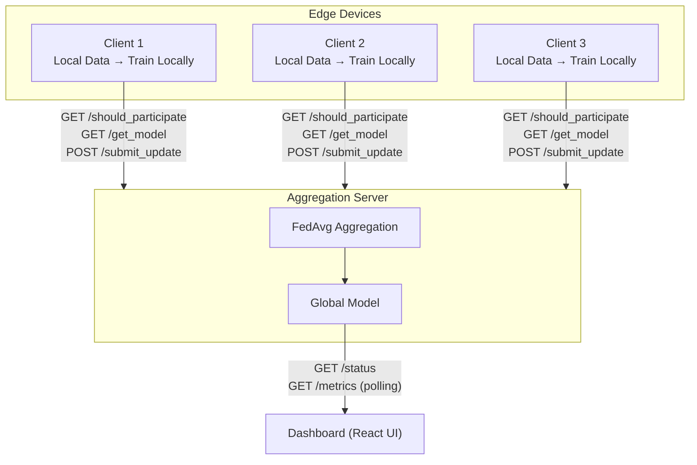
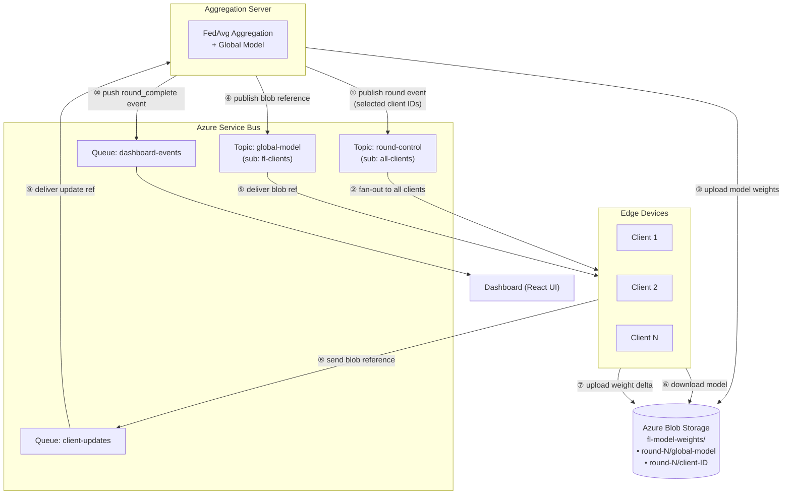
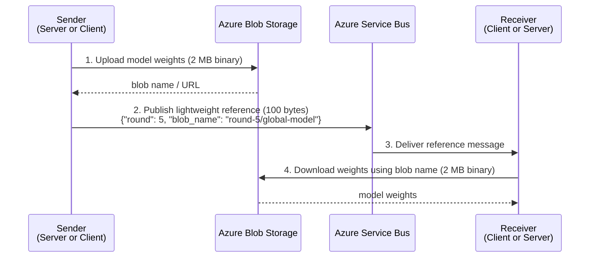

# Federated Learning System for Edge Devices

A distributed machine learning system implementing **Federated Learning** to train models across multiple edge devices without sharing raw data. This project demonstrates key distributed systems principles including asynchronous communication, fault tolerance, privacy preservation, and real-time monitoring.

The system supports two communication modes: **HTTP REST** (original) and **Azure Service Bus** (event-driven messaging with claim-check pattern for large payloads).

---

## Table of Contents

- [Overview](#overview)
- [Features](#features)
- [System Architecture](#system-architecture)
- [Azure Service Bus Integration](#azure-service-bus-integration)
- [Prerequisites](#prerequisites)
- [Installation](#installation)
- [Azure Cloud Setup](#azure-cloud-setup)
- [Quick Start](#quick-start)
- [Project Structure](#project-structure)
- [Environment Variables](#environment-variables)
- [Team Members](#team-members)

---

## Overview

### What is Federated Learning?

Federated Learning is a machine learning approach where:
- **Training happens on edge devices** (phones, IoT sensors, hospitals)
- **Only model updates are shared**, not raw data
- **Privacy is preserved** - sensitive data never leaves the device
- **Global model improves** through collaboration without centralization

### Problem Statement

Traditional machine learning requires centralizing data, which:
- Raises serious privacy concerns (GDPR, HIPAA)
- Uses massive bandwidth (transmitting raw data)
- Creates single points of failure
- Is insecure (data in transit and at rest)

### Our Solution

Federated Learning System that:
- Keeps data on edge devices (privacy preserved)
- Trains models locally (distributed computation)
- Shares only model updates (bandwidth efficient)
- Aggregates updates into global model (consensus protocol)
- Supports non-IID data (real-world conditions)
- Includes differential privacy (optional)
- Provides real-time monitoring (dashboard)
- Uses Azure Service Bus for event-driven communication (replaces HTTP polling)

---

## Features

### Core Functionality
- **Federated Averaging (FedAvg)**: Weighted aggregation of client updates
- **Asynchronous Communication**: Clients work independently
- **Partial Participation**: Not all clients needed per round
- **Non-IID Data Distribution**: Realistic data heterogeneity
- **Differential Privacy**: Optional noise addition for privacy
- **Model Evaluation**: Automatic accuracy/loss tracking

### Technical Features
- **Dual Transport**: HTTP REST polling or Azure Service Bus (event-driven)
- **Claim-Check Pattern**: Large model weights stored in Azure Blob Storage, lightweight references passed through Service Bus
- **Dead Letter Queues**: Failed messages routed to DLQ for debugging
- **RESTful API**: FastAPI-based server (retained for dashboard and backward compatibility)
- **Real-time Dashboard**: React-based visualization
- **Scalable**: Support for 10-200+ clients
- **Fault Tolerant**: Handles client disconnections, stale rounds, and transport fallback
- **Modular Design**: Clean separation of concerns

---

## System Architecture

### HTTP Mode (Original)

In HTTP mode, clients **poll** the server repeatedly to check participation, download models, and submit updates:



### Azure Service Bus Mode (Event-Driven)

In Service Bus mode, the server **pushes** events to clients through topics, and clients **send** updates through queues. No polling needed — communication is fully event-driven:



---

## Azure Service Bus Integration

### How It Works

The integration replaces the HTTP polling communication layer with Azure Service Bus while keeping all ML logic (model training, FedAvg aggregation, differential privacy) untouched.

#### 1. Round Control (Topic: `round-control`)

**Before (HTTP):** Each client polls `GET /should_participate` every 3 seconds to check if selected.

**After (Service Bus):** Server publishes a single message to the `round-control` topic when a new round starts. The message contains the round ID and list of selected clients. All clients subscribe to this topic and check if their ID is in the selected list.

```
Server publishes:
{
  "round": 5,
  "selected_clients": ["1", "3"],
  "timestamp": "2025-03-22T10:30:00"
}

→ Client 1 receives message, sees it's selected → starts training
→ Client 2 receives message, sees it's NOT selected → waits for next
→ Client 3 receives message, sees it's selected → starts training
```

#### 2. Global Model Distribution (Topic: `global-model` + Blob Storage)

**Before (HTTP):** Each selected client calls `GET /get_model` to download ~5 MB of JSON weights.

**After (Service Bus + Claim-Check):** Model weights are too large for Service Bus messages (256 KB limit). We use the **claim-check pattern**:

1. Server serializes model weights with `torch.save()` (~2 MB binary)
2. Server uploads to Azure Blob Storage as `round-{N}/global-model`
3. Server publishes a lightweight reference message to the `global-model` topic:
   ```json
   {"round": 5, "blob_name": "round-5/global-model"}
   ```
4. Clients receive the reference, download the blob, deserialize with `torch.load()`

#### 3. Client Updates (Queue: `client-updates` + Blob Storage)

**Before (HTTP):** Clients `POST /submit_update` with ~5 MB JSON payload.

**After (Service Bus + Claim-Check):** Same claim-check pattern in reverse:

1. Client computes weight delta (local - global), applies DP if enabled
2. Client uploads delta to Blob Storage as `round-{N}/client-{ID}`
3. Client sends reference message to the `client-updates` queue:
   ```json
   {"client_id": "1", "round": 5, "blob_name": "round-5/client-1", "data_size": 6000}
   ```
4. Server receives from queue, downloads blob, feeds into FedAvg aggregation

#### 4. Dashboard Events (Queue: `dashboard-events`)

**Before (HTTP):** Dashboard polls `/status` every 2s and `/metrics` every 3s.

**After (Service Bus):** Server pushes events to the `dashboard-events` queue whenever a round completes:
```json
{"type": "round_complete", "round": 5, "accuracy": 0.94, "loss": 0.21}
```

The REST endpoints remain active, so the dashboard works in both modes without changes.

### Why Service Bus Over Plain HTTP?

| Aspect | HTTP Polling | Azure Service Bus |
|--------|-------------|-------------------|
| Communication | Request/response, client-initiated | Event-driven, server pushes |
| Efficiency | Clients waste cycles polling | Clients block until notified |
| Decoupling | Tight coupling (clients need server URL) | Loose coupling via message broker |
| Reliability | Lost if server is temporarily down | Messages persisted in queue |
| Scalability | Each client creates load on server | Service Bus handles fan-out |
| Dead letters | Manual error handling | Built-in DLQ for failed messages |
| Large payloads | Inline JSON (~5 MB per request) | Claim-check via Blob Storage (~2 MB binary) |

### Claim-Check Pattern

The claim-check pattern solves the problem of sending large payloads through a message broker that has size limits:



Old blobs are automatically cleaned up — only the last 3 rounds are kept.

---

## Prerequisites

### Software Requirements

- **Python**: 3.8 - 3.12 (recommended: 3.11)
- **Node.js**: 16.0+ (for React dashboard)
- **npm**: 8.0+ (comes with Node.js)
- **pip**: 21.0+ (for Python packages)

### Hardware Requirements

- **Minimum**: 4GB RAM, 2 CPU cores
- **Recommended**: 8GB RAM, 4 CPU cores
- **Storage**: ~500MB for dataset and dependencies

### Azure Requirements (for Service Bus mode only)

- An Azure account with an active subscription
- Permissions to create Service Bus Namespaces and Storage Accounts

---

## Installation

### Step 1: Clone Repository

```bash
git clone https://github.com/Iqra-Z/federated-learning-project
cd federated-learning-project
```

### Step 2: Install Python Dependencies

```bash
pip install -r requirements.txt
```

**What gets installed:**
- FastAPI + Uvicorn (web framework)
- PyTorch + TorchVision (machine learning)
- NumPy (data processing)
- Requests (HTTP client)
- azure-servicebus (Service Bus SDK)
- azure-storage-blob (Blob Storage SDK)
- azure-identity (Azure authentication)

### Step 3: Setup React Dashboard

```bash
cd dashboard
npm install
cd ..
```

---

## Azure Cloud Setup

These steps create the Azure resources needed to run the system in Service Bus mode.

### Step 1: Create a Resource Group

```bash
az login
az group create --name fl-demo-rg --location eastus
```

### Step 2: Create a Service Bus Namespace (Standard tier)

Standard tier is required for Topics (Basic only supports Queues).

```bash
az servicebus namespace create \
  --name fl-demo-sb \
  --resource-group fl-demo-rg \
  --sku Standard \
  --location eastus
```

### Step 3: Create Topics and Subscriptions

```bash
# Topic: round-control (server → clients)
az servicebus topic create \
  --namespace-name fl-demo-sb \
  --resource-group fl-demo-rg \
  --name round-control

# Subscription on round-control: all clients receive all messages
az servicebus topic subscription create \
  --namespace-name fl-demo-sb \
  --resource-group fl-demo-rg \
  --topic-name round-control \
  --name all-clients

# Topic: global-model (server → clients, carries blob references)
az servicebus topic create \
  --namespace-name fl-demo-sb \
  --resource-group fl-demo-rg \
  --name global-model

# Subscription on global-model
az servicebus topic subscription create \
  --namespace-name fl-demo-sb \
  --resource-group fl-demo-rg \
  --topic-name global-model \
  --name fl-clients
```

### Step 4: Create Queues

```bash
# Queue: client-updates (clients → server)
az servicebus queue create \
  --namespace-name fl-demo-sb \
  --resource-group fl-demo-rg \
  --name client-updates

# Queue: dashboard-events (server → dashboard)
az servicebus queue create \
  --namespace-name fl-demo-sb \
  --resource-group fl-demo-rg \
  --name dashboard-events
```

### Step 5: Create a Storage Account + Blob Container

```bash
# Create storage account (name must be globally unique, lowercase, no hyphens)
az storage account create \
  --name fldemostore \
  --resource-group fl-demo-rg \
  --sku Standard_LRS \
  --location eastus

# Create blob container for model weights
az storage container create \
  --name fl-model-weights \
  --account-name fldemostore
```

### Step 6: Get Connection Strings

```bash
# Service Bus connection string
az servicebus namespace authorization-rule keys list \
  --namespace-name fl-demo-sb \
  --resource-group fl-demo-rg \
  --name RootManageSharedAccessKey \
  --query primaryConnectionString \
  --output tsv

# Storage account connection string
az storage account show-connection-string \
  --name fldemostore \
  --resource-group fl-demo-rg \
  --query connectionString \
  --output tsv
```

Copy both connection strings — you'll need them as environment variables.

### Step 7: Set Environment Variables

Create a `.env` file or export in your terminal:

```bash
export FL_TRANSPORT=servicebus
export AZURE_SERVICEBUS_CONNECTION_STRING="Endpoint=sb://fl-demo-sb.servicebus.windows.net/;SharedAccessKeyName=RootManageSharedAccessKey;SharedAccessKey=YOUR_KEY_HERE"
export AZURE_STORAGE_CONNECTION_STRING="DefaultEndpointsProtocol=https;AccountName=fldemostore;AccountKey=YOUR_KEY_HERE;EndpointSuffix=core.windows.net"
```

## Quick Start

### Option A: HTTP Mode (No Azure Needed)

This is the default mode. No Azure resources required.

**Terminal 1: Start Server**
```bash
python server/main.py
```

**Terminal 2-4: Start Clients**
```bash
python clients/client.py 1 --non-iid
python clients/client.py 2 --non-iid
python clients/client.py 3 --non-iid
```

**Terminal 5: Start Dashboard**
```bash
cd dashboard
npm start
```

### Option B: Azure Service Bus Mode

Make sure the Azure resources are created and environment variables are set (see [Azure Cloud Setup](#azure-cloud-setup)).

**Terminal 1: Start Server**
```bash
export FL_TRANSPORT=servicebus
export AZURE_SERVICEBUS_CONNECTION_STRING="..."
export AZURE_STORAGE_CONNECTION_STRING="..."
python server/main.py
```

Expected output:
```
[SERVER] Azure Service Bus transport ENABLED
[SB] Starting client-updates receiver thread...
======================================================================
🚀 FEDERATED LEARNING SERVER
======================================================================
📍 Server:    http://127.0.0.1:9000
🔗 Transport: Azure Service Bus
⚙️  Min Updates: 2
⚙️  Participation: 50%
⚙️  Timeout: 45s
======================================================================
```

**Terminal 2-4: Start Clients**
```bash
export FL_TRANSPORT=servicebus
export AZURE_SERVICEBUS_CONNECTION_STRING="..."
export AZURE_STORAGE_CONNECTION_STRING="..."

python clients/client.py 1 --transport servicebus --non-iid
python clients/client.py 2 --transport servicebus --non-iid
python clients/client.py 3 --transport servicebus --non-iid
```

Expected output (per client):
```
[CLIENT] Azure Service Bus transport ENABLED
[Client 1] Running in Service Bus transport mode
[Client 1] Waiting for round-control message...
[Client 1] Selected for round 0. Receiving global model...
[Client 1] Training locally...
[Client 1] Sending update via Service Bus... (DP=OFF)
[SB] Client 1 submitted update for round 0
[Client 1] Update sent for round 0. Waiting for next round...
```

**Terminal 5: Start Dashboard** (same as HTTP mode — no changes needed)
```bash
cd dashboard
npm start
```

### Option C: Mixed Mode (HTTP + Service Bus clients in same round)

You can run some clients in HTTP mode and others in Service Bus mode simultaneously. The server accepts updates from both transports:

```bash
# Client 1: Service Bus
python clients/client.py 1 --transport servicebus --non-iid

# Client 2: HTTP (default)
python clients/client.py 2 --non-iid

# Client 3: Service Bus with DP
python clients/client.py 3 --transport servicebus --non-iid --dp
```

---

## Project Structure

```
federated-learning-project/
│
├── server/
│   ├── main.py              # FastAPI server + Service Bus publishing/receiving
│   └── aggregator.py        # FedAvg aggregation logic
│
├── clients/
│   ├── client.py            # Client loop (HTTP + Service Bus modes)
│   ├── data_utils.py        # MNIST data loading and partitioning
│   └── training.py          # Local training loop
│
├── fl_core/
│   └── model_def.py         # SimpleCNN model architecture
│
├── service_bus/             # Azure Service Bus integration layer
│   ├── __init__.py          # Package exports
│   ├── config.py            # Environment variable configuration
│   ├── serialization.py     # torch.save/load weight serialization
│   ├── claim_check.py       # Azure Blob Storage upload/download
│   └── manager.py           # ServiceBusManager (pub/sub/queue operations)
│
├── dashboard/               # React monitoring app
│   ├── src/
│   │   ├── App.js           # Main dashboard component
│   │   └── App.css          # Styling
│   └── package.json
│
├── data/                    # Auto-created on first run
│   └── MNIST/
│
├── requirements.txt         # Python dependencies
└── README.md                # This file
```

### Key Files for Azure Integration

| File | What It Does |
|------|-------------|
| `service_bus/config.py` | Reads all Azure settings from environment variables |
| `service_bus/claim_check.py` | Uploads/downloads model weights to/from Azure Blob Storage |
| `service_bus/serialization.py` | Converts model weights between PyTorch tensors and bytes |
| `service_bus/manager.py` | All Service Bus operations: publish to topics, send/receive from queues |
| `server/main.py` | Server-side: publishes round events, receives updates from queue |
| `clients/client.py` | Client-side: subscribes to topics, submits updates via queue |

---

## Environment Variables

| Variable | Default | Description |
|----------|---------|-------------|
| `FL_TRANSPORT` | `http` | Transport mode: `http` or `servicebus` |
| `AZURE_SERVICEBUS_CONNECTION_STRING` | (none) | Service Bus namespace connection string |
| `AZURE_STORAGE_CONNECTION_STRING` | (none) | Blob Storage account connection string |
| `AZURE_STORAGE_CONTAINER` | `fl-model-weights` | Blob container name |
| `SB_ROUND_CONTROL_TOPIC` | `round-control` | Topic name for round announcements |
| `SB_GLOBAL_MODEL_TOPIC` | `global-model` | Topic name for model distribution |
| `SB_CLIENT_UPDATES_QUEUE` | `client-updates` | Queue name for client weight updates |
| `SB_DASHBOARD_EVENTS_QUEUE` | `dashboard-events` | Queue name for dashboard events |
| `FL_PARTICIPATION_PROB` | `0.5` | Fraction of clients selected per round |
| `FL_AGG_TIMEOUT` | `45.0` | Seconds before timeout triggers aggregation |

---

## Communication Flow

### HTTP Mode
1. **Poll**: Client polls `GET /should_participate` (every 3s)
2. **Download**: Client calls `GET /get_model` (5 MB JSON)
3. **Train**: Client trains locally on its MNIST partition
4. **Upload**: Client sends `POST /submit_update` (5 MB JSON delta)
5. **Wait**: Client polls `GET /config` until round advances
6. **Monitor**: Dashboard polls `/status`, `/metrics` (every 2-3s)

### Service Bus Mode
1. **Wait**: Client blocks on `round-control` topic subscription
2. **Receive**: Client gets model via `global-model` topic + Blob download (2 MB binary)
3. **Train**: Client trains locally (same as HTTP)
4. **Send**: Client uploads delta to Blob, sends reference to `client-updates` queue
5. **Wait**: Client blocks on next `round-control` message (no polling)
6. **Monitor**: Server pushes events to `dashboard-events` queue

---

## Team Members

| Name | Role | Responsibilities |
|------|------|------------------|
| Iqra Zahid, Kianmehr Haddad Zahmatkesh | ML Engineer & Project Lead | System design, integration, model training, dataset partitioning, FedAvg logic |
| Abdulkarim Noorzaie, Owais AbdurRahman | Full-Stack Developer | Dashboard UI, API server, visualization, metrics tracking |

---

## Acknowledgments

- **Instructor**: Dr. Khalid A. Hafeez
- **Course**: SOFE4790U - Distributed Systems (Fall 2025)
- **Cloud Demo Course**: Azure Service Bus Integration
- **Institution**: Ontario Tech University
- **Team Members**: Iqra Zahid, Kianmehr Haddad Zahmatkesh, Abdulkarim Noorzaie, Owais AbdurRahman

**Last Updated**: March 2026
**Version**: 2.0.0
